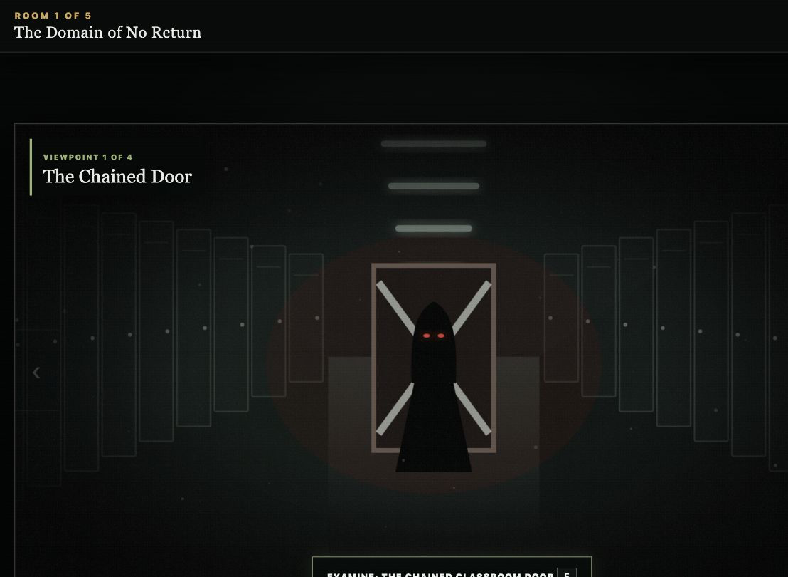
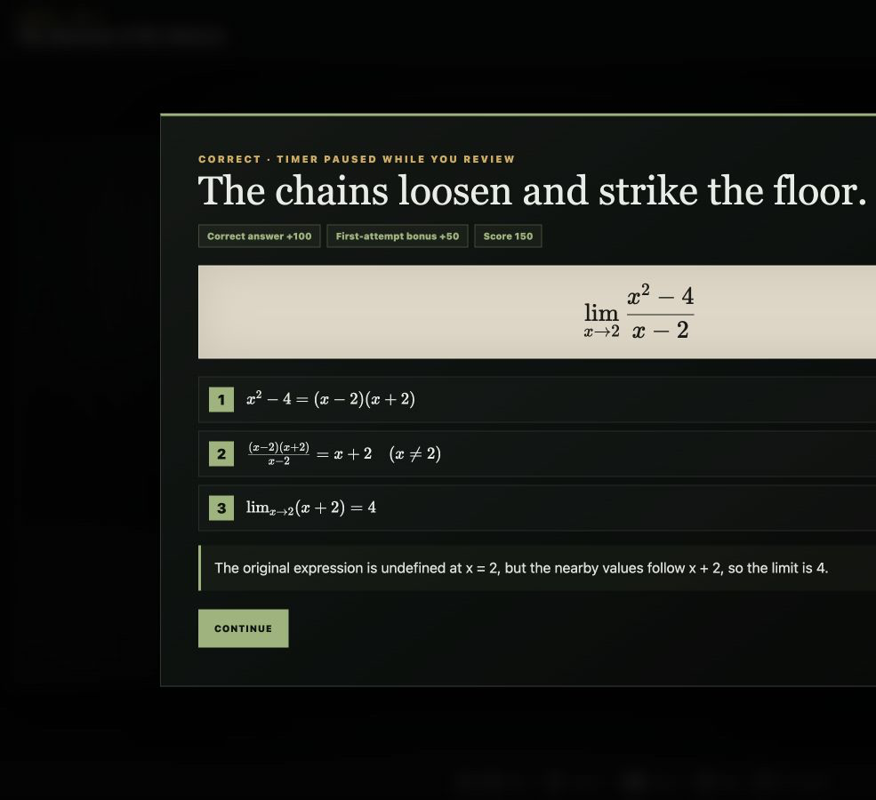

# Game Mechanics, Rules, and Sample Play

## Objective

Escape Meridian Senior High by completing all five calculus rooms before the active countdown reaches zero. A technically successful escape is not automatically the best ending: spirit rescues and Entity pressure determine whether the loop is truly broken.

## Starting a run

1. Read the content warning.
2. Choose **Start New Game** or **Continue**.
3. Read or skip the introduction.
4. Begin Room 1. An autosave is written immediately.

## Navigation

The game uses fixed first-person viewpoints rather than free-roaming 3D movement.

| Action | Keyboard | Mouse |
|---|---|---|
| Move between unlocked viewpoints | `A` / `D` or arrows | Edge arrows |
| Interact | `E` or `Enter` | Click hotspot |
| Select answer | `1`–`4` | Click option |
| Submit | `Enter` | Submit button |
| Hint | `H` | Hint button |
| Map | `M` | Room Map button |
| Pause | `Esc` | Pause button |
| Fullscreen | `F` | Fullscreen control |

Puzzle stations unlock sequentially. Completed stations remain available for review.

## Answer rules

### Numeric input

Accepted formats include:

- Integer: `4`
- Decimal: `2.5`
- Fraction: `5/2`
- Negative number: `-2`

Equivalent fractions and decimals are accepted within a small tolerance.

### Multiple choice

Select an option using `1`–`4` or the mouse, then submit. Controlled options avoid unreliable free-form symbolic matching.

### Incorrect answers

An incorrect answer:

- Deducts 25 points
- Increases Entity pressure by 14
- Removes the first-attempt bonus for that question
- Triggers a room and sound reaction
- Leaves the question open for another attempt

### Hints

A hint costs 50 points and is charged only once for that question. Reopening the same hint is free.

## Timer rules

The active time limit is **30 minutes**.

The timer continues while solving a question. It pauses during:

- Introduction and room-introduction scenes
- Full worked solutions
- Map, settings, achievements, credits, and pause screens
- Ending and result screens

This keeps pressure during problem solving without punishing students for reading explanations.

## Entity pressure and capture

At 100% pressure, the Entity captures the player briefly:

- Pressure resets to 64%.
- One minute is removed from the timer.
- The current question remains available.
- Progress and solved questions are preserved.

## Saving and checkpoints

The game saves after meaningful actions, including:

- Correct or incorrect answer
- Hint use
- Spirit decision
- Room completion
- Settings change
- Ending

`Continue` restores the current room, unlocked viewpoint, score, timer, spirits, pressure, and achievements through LocalStorage.

## Room completion

1. Solve every required question in the room.
2. Meet the trapped spirit when present.
3. Rescue or leave the spirit.
4. Receive the +250 room bonus.
5. Continue to the next autosaved room.

The spirit choice is optional for basic progression, but it determines achievements and the ending.

## Sample play

### 1. Wake inside the Domain

The player sees a chained classroom door and presses `E`.

### 2. Solve the first limit

The game displays:

$$
\lim_{x\to2}\frac{x^2-4}{x-2}
$$

The player factors:

$$
x^2-4=(x-2)(x+2)
$$

After cancellation, the nearby expression is `x + 2`, so the player enters `4`.

**Result:** +100 correct-answer points and +50 first-attempt points. The chains fall and the solution screen opens while the timer pauses.

### 3. Make a mistake

At the one-sided-limit station, the player chooses an incorrect branch.

**Result:** −25 points, +14 pressure, a red screen reaction, and another attempt.

### 4. Use a hint

The player presses `H`.

**Result:** −50 points. The hint explains that a left-hand limit uses the branch for values below the approach point.

### 5. Decide Mara’s fate

After the three Room 1 questions, the player meets Mara.

- Rescue Mara: counts toward Soul Saver and True Escape.
- Leave Mara: the game continues, but the best ending becomes unavailable.

### 6. Cross the Infinite Abyss

The bridge displays:

$$
\lim_{x\to\infty}\frac{5x^2-3x+1}{2x^2+7}
$$

The player enters `5/2`. A missing bridge span returns.

### 7. Complete the Final Exam

Five cumulative questions break five seals.

- All spirits and pressure ≤ 50%: **True Escape**
- Otherwise: **Hollow Escape**
- Timer reaches zero: **Lost Soul**

## Sample interface evidence

