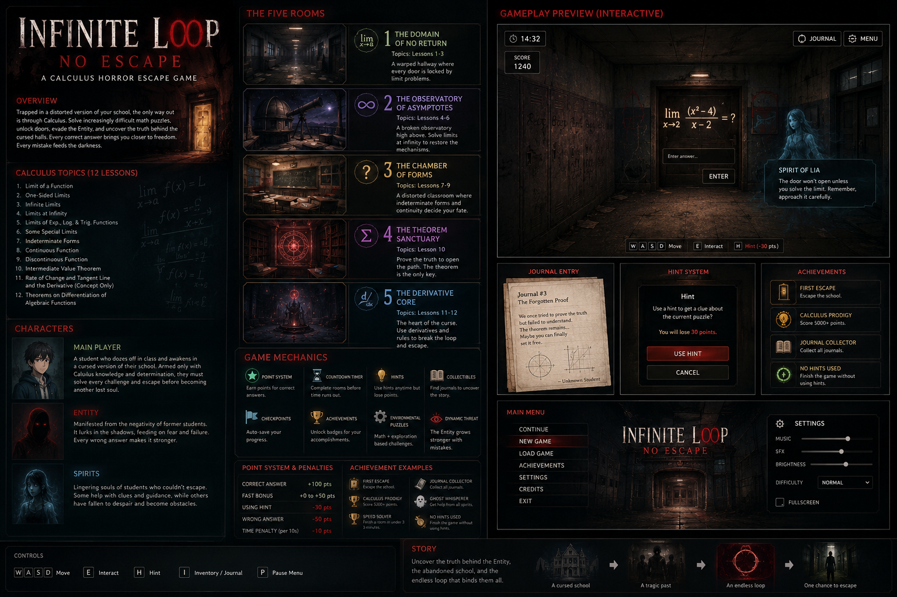
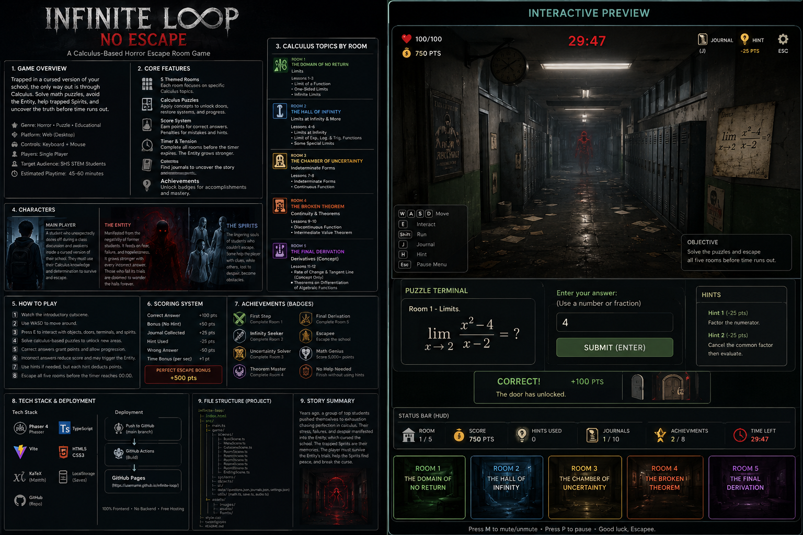

# Art Bible and Visual Production

## Visual identity: Analog Calculus Horror

The final visual direction combines abandoned-school imagery, restrained VHS noise, live mathematical notation, and a minimal institutional interface.

Horror should increase tension without obscuring the calculus task.

## Palette

| Purpose | Direction |
|---|---|
| Base environment | Charcoal black and near-black green |
| Safe interface text | Warm off-white |
| Supernatural school light | Sickly teal and desaturated green |
| Entity and incorrect feedback | Deep crimson |
| Correct answers and navigation | Muted green |
| Achievements | Amber-gold |
| Final Exam | Desaturated violet with crimson threat accents |

## Visual rules

1. Keep a consistent first-person camera height.
2. Keep puzzle objects and lower interaction areas readable.
3. Never embed critical formulas into generated images.
4. Render equations through KaTeX.
5. Use one dominant accent per room while retaining the charcoal base.
6. Keep the Entity silhouette consistent: hooded black mass, hidden face, two red eyes.
7. Avoid gore and realistic injury.
8. Avoid real school logos and official branding inside the horror environment.
9. Make reduced-motion mode remove drift, shake, pulses, and noise movement.
10. Repeat important environmental information in text rather than color alone.

## Room identities

### Room 1 — Domain of No Return

- Warped lockers
- Chained classroom door
- Red emergency light
- Long hallway perspective
- First distant Entity appearance

### Room 2 — Infinite Abyss

- Broken wooden bridge
- Cold fog with no visible bottom
- Distant signal lantern
- Bridge spans reconstructed by correct limits

### Room 3 — Poor, Undefined Souls

- Haunted classroom
- Floating papers and incomplete equations
- Damaged attendance register
- Teal-gray student spirits

### Room 4 — Changes in Rate of Survival

- Graph grids and moving walls
- Large derivative mechanism
- Rust and warm-crimson accents
- Architecture aligned to invisible axes

### Room 5 — Final Exam

- Repeating examination desks
- Entity as proctor
- Large blackboard
- Violet-gray palette
- Five final seals

## Interface direction

- Serif display type for horror titles and room names
- Sans-serif type for rules and explanations
- Monospaced digits for time and score
- Thin borders and dark translucent panels
- Gold eyebrow labels
- Red danger buttons and green correct feedback
- Visible keyboard focus states

## Concept art production

Three visual-development concept boards are stored in `docs/visuals/`. Approved Canva exports for the front/loading and credits screens are stored as optimized runtime assets in `src/assets/`.

They establish:

- Entity silhouette
- Abandoned-school mood
- Palette relationships
- Room-to-room color differences
- Promotional hierarchy
- Interface density

The final runtime rooms were rebuilt as original procedural SVG/canvas scenes. This provides:

- Consistent perspective
- Fast GitHub Pages loading
- Responsive 16:9 scaling
- No rasterized calculus text
- Easy reduced-motion support
- A self-contained single-file build

## Asset log

| Asset | Method | Purpose | Final use |
|---|---|---|---|
| Concept board 1 | Project concept art | Overall design exploration | Documentation |
| Concept board 2 | Project concept art | Promotional and room hierarchy | Documentation |
| Concept board 3 | Project concept art | Gameplay-oriented layout | Documentation |
| Front/loading artwork | Approved Canva export | Entity and haunted-classroom screen artwork | Main menu and introduction |
| Credits header | Approved Canva export | Project title artwork | Project credits |
| Five room scenes | Original procedural SVG | Optimized runtime environments | Playable game |
| Interface | Original HTML/CSS | Responsive controls and HUD | Playable game |
| Equations | KaTeX | Accurate live notation | Playable game |
| Audio | Web Audio synthesis | Ambience and feedback | Playable game |

## Concept boards

